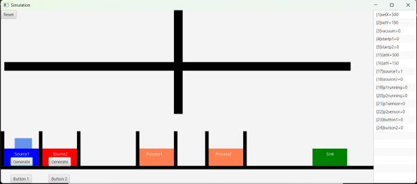

# Simulation_Project_Python

**Industrial Crane Pick-and-Place Controller via Modbus TCP — Python**

A Python-based controller for an industrial crane simulation. The script reads
a JSON action plan and executes each step by writing commands to a Modbus TCP
server — moving the crane in X/Y and controlling the vacuum gripper to pick up
objects and place them at target locations.

---

## What it does

The crane performs a fully automated pick-and-place cycle driven by a JSON
action list. Each step in the list sets one or more of three Modbus registers:

| Register | Address | Function |
|----------|---------|----------|
| `setX` | 1 | Move crane to X position |
| `setY` | 2 | Move crane to Y position |
| `vacuum` | 3 | Grip (`1`) or release (`0`) |

The controller loops through every step, writes the relevant register(s), and
waits 2.5 seconds between commands so the crane has time to complete each move
before the next command is sent.

## Simulation

The controller drives a simulated manufacturing cell — two part sources, two
process stations, and a sink — connected over Modbus TCP. The panel on the
right shows the live register values: crane position (`setX`/`setY`), vacuum
state, source/process sensors, and process status.


---

## Files

| File | Description |
|------|-------------|
| `crane_grade_E.py` | Main controller — reads the action plan and drives the crane |
| `actions_grade_E.json` | JSON action plan defining the full pick-and-place sequence |
| `simulation.exe` | Modbus TCP simulation server (the virtual crane) |

---

## How to run

**Prerequisites**

```bash
pip install pymodbus
```

**Steps**

1. Start `simulation.exe` first — this launches the Modbus TCP server on
   `127.0.0.1:502`.
2. Run the controller:

```bash
python crane_grade_E.py
```

The terminal prints each step as it executes:

```
Step 1 {'vacuum': 0}
Step 2 {'setX': 55, 'setY': 250}
Step 3 {'setX': 55, 'setY': 82}
...
Done.
```

---

## Action plan format

`actions_grade_E.json` defines the crane's movement sequence as a list of
steps. Each step is a small dict containing one or more keys (`setX`, `setY`,
`vacuum`). Only the keys present in a step are written — so a step with only
`vacuum` does not move the crane.

```json
{
  "actions": [
    { "vacuum": 0 },
    { "setX": 55,  "setY": 250 },
    { "setX": 55,  "setY": 82  },
    { "vacuum": 1 },
    { "setX": 55,  "setY": 250 },
    { "setX": 450, "setY": 250 },
    { "setX": 450, "setY": 82  },
    { "vacuum": 0 }
  ]
}
```

The sequence above picks an object at X=55, carries it to X=450, and releases
it. The full action file in the repo extends this to three drop-off locations.

---

## Key concepts demonstrated

- **Modbus TCP communication** using `pymodbus` — connecting to a simulation
  server and writing registers to control physical-world signals.
- **Data-driven control** — the movement logic lives entirely in the JSON file,
  not in the Python code. Changing the crane's behaviour requires only editing
  the action plan, not the controller.
- **Separation of concerns** — the controller (`crane_grade_E.py`) handles
  communication; the action plan (`actions_grade_E.json`) handles task logic.

---

## Context

This project was an early exercise in industrial automation and Modbus TCP
communication, completed as part of the Python for Automation course at University West. It later evolved into the full
[MUA600-Multi-Agent-Manufacturing](https://github.com/gabrieldanho9988-sys/MUA600-Multi-Agent-Manufacturing)
project, where the crane is controlled by a decentralized CMAS multi-agent
system with LLM order intake instead of a static action list.
